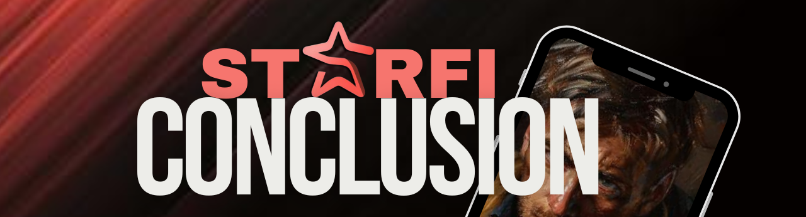

# 🏁 Conclusion

<figure><figcaption></figcaption></figure>

StarFi is set to redefine the social media landscape by merging it with the dynamic world of digital asset trading. By leveraging the Internet Computer Protocol, StarFi offers a secure, decentralized platform for creators and collectors alike. Join us in revolutionizing how personal media is owned, traded, and monetized.
