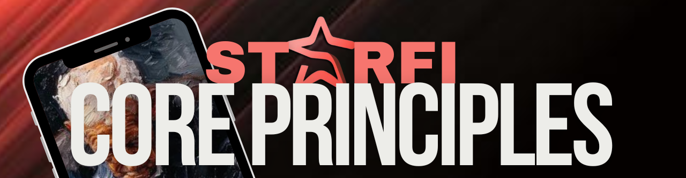

# 📜 Core Principles

<figure><figcaption></figcaption></figure>

* <mark style="color:purple;">**Decentralization:**</mark> Built on the ICP blockchain, StarFi ensures data security, transparency, and user sovereignty, giving creators full control over their digital assets.
* <mark style="color:purple;">**Community Empowerment:**</mark> Foster a community-driven marketplace where digital creators and art enthusiasts can thrive by creating, trading, and owning unique digital collectibles.
* <mark style="color:purple;">**Innovative Monetization:**</mark> Provide innovative tools and features that enable creators to monetize their content effectively, opening new avenues for income through digital art.
* <mark style="color:purple;">**User-Friendly Experience:**</mark> Seamless integration of social media features with blockchain technology to cater to Web3 users and attract Web2 users.
* <mark style="color:purple;">**Sustainability:**</mark> Implement mechanisms to maintain healthy inflation levels and ensure economic balance within the platform, supporting long-term growth and stability.
