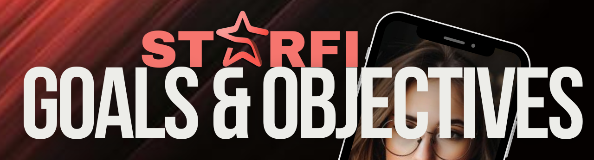

# 🎯 Goals & Objectives

<figure><figcaption></figcaption></figure>

* <mark style="color:green;">**Empower Creators:**</mark> Provide tools and a seamless platform for digital creators to easily mint their personal media, including photos, paintings, sketches, digital drawings, AI creations, and abstracts, as unique digital collectibles (NFTs).
* <mark style="color:green;">**Enhance Engagement:**</mark> Create a vibrant social environment where creators and enthusiasts can connect, share their work, trade NFTs, and support their favorite artists. Encourage meaningful interactions through features like mini-blogs, social posts, and direct messaging.


The Mini-blogs and Social posting on the platform is be for a later date. See Roadmap for details.


* <mark style="color:green;">**Facilitate Monetization:**</mark> Offer multiple ways for creators to earn from their digital assets. This includes trading in the marketplace, locking NFTs for airdrops, and participating in special events or promotions that reward active engagement.
* <mark style="color:green;">**Ensure Security:**</mark> Utilize the Internet Computer Protocol’s (ICP) strong security measures to safeguard user data and digital assets. Ensure that users feel confident and secure when using the platform.
* <mark style="color:green;">**Sustainable Growth:**</mark> Develop a scalable and sustainable economic model that supports the long-term success of the platform. Balance user incentives with platform sustainability to create a thriving ecosystem for digital creators and art enthusiasts.
