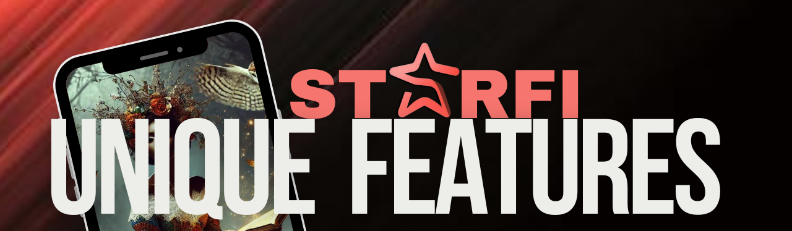

# 🦄 Unique Features

<figure><figcaption></figcaption></figure>

* <mark style="color:orange;">**Decentralized Platform**</mark><mark style="color:orange;">:</mark> StarFi leverages the ICP blockchain to ensure a secure, transparent, and user-controlled environment, encouraging more digital creators and art enthusiasts to join the Web3 ecosystem.

***

* <mark style="color:orange;">**Inclusive Art Platform**</mark><mark style="color:orange;">:</mark> StarFi welcomes all forms of art, from daily photos and paintings to sketches, digital drawings, AI creations, and abstracts. The platform makes it easy for artists of all levels to upload and mint their work as NFTs.

***

* <mark style="color:orange;">**NFT Ownership:**</mark> StarFi offers decentralized NFT minting, ensuring users have full ownership of their NFTs from creation. Using the ICP blockchain, users can mint, manage, and transfer their NFTs directly to wallets like Stoic or Plug without platform ownership. This feature guarantees complete user control and interoperability, setting StarFi apart in the digital collectibles space.

***

* <mark style="color:orange;">**User Verification to Prevent Abuse**</mark><mark style="color:orange;">:</mark> To protect the community from non-digital artists and non-art enthusiasts who might abuse the system, StarFi requires new users to fill out a verification form upon registration. This form is reviewed within 24 working hours to ensure that only genuine creators and enthusiasts join the platform, maintaining its quality and integrity.

***

* <mark style="color:orange;">**In-Game Currency Only:**</mark> $star is strictly an in-game digital currency and cannot be staked or traded outside the platform.&#x20;


STC: Users can deposit 0.1 ICP to get 1000 $star tokens in-game and can only withdraw $star tokens for ICP with a balance of 10,000 $star for 1 ICP.


***

* <mark style="color:orange;">**Two Rarity Levels:**</mark> There is only two types of card Rarity namely; <mark style="background-color:blue;">**RARE**</mark> and <mark style="background-color:orange;">**MYTHIC**</mark>. Artists mint 6 copies of RARE and 2 copies of MYTHIC cards. These quantities remain fixed.

***

* <mark style="color:orange;">**Card Locking for Airdrops:**</mark> Users can lock artist cards to earn airdrops when the artist mints new collections. The more cards you lock, the higher your chances based on percentages. Locking of cards will be flexible, but, the combination of Rarities will determine the +% you get towards the artist.


This feature rewards active community members and encourages ongoing engagement with the platform.



STC: Rare card airdrop percentage is set at 5%, and Mythic card airdrop percentage is set at 0.33%.



STC: Lock Rare + Rare set = +0.1% boost. Lock Rare + Mythic = + 0.4% boost. Lock Mythic + Mythic = +0.8% boost.



Users who have Minted, Traded and Locked atleast five (5) different artist cards automatically qualify for $star tokens airdrop.


***

* <mark style="color:orange;">**Minting Cost:**</mark> Artists can mint new cards at any time, provided they pay \[..] $star per mint, with no cooldown period.

***

* <mark style="color:orange;">**Deposit Mechanism:**</mark> Users can deposit ICP to buy $star currency directly within their wallets.&#x20;


STC: The exchange rate is 0.1 ICP for 1000 $star tokens.


***

* <mark style="color:orange;">**Regulated Trading Values**</mark><mark style="color:orange;">:</mark> Users can only trade cards for their matching value, make offers on cards using $star token, or set a Quick-buy value. This regulation helps prevent platform abuse and ensures fair trading practices.

***

* <mark style="color:orange;">**In-Game Social Space:**</mark> A social space where artists can interact about their day or art, post mini-blogs or tweets (up to 150 words). The micro blog or tweet will enable the share images, gifs and emojis.&#x20;


STC: These posts can be shared on social media platforms like Twitter, Instagram, and TikTok. See Roadmap for details.



STC: The aim of this feature is to keep users immersed within the StarFi platform. To activate this social space, users must hold at least 1 $ICP in their wallet.


***

* <mark style="color:orange;">**Message Points System:**</mark> To send and unlock direct messages (DMs) to artists, users need Message Points. Both sender and receiver must use points to unlock the DM, and once unlocked, messaging is free for life. This system ensures meaningful and respectful communication.


See Roadmap for more details.

